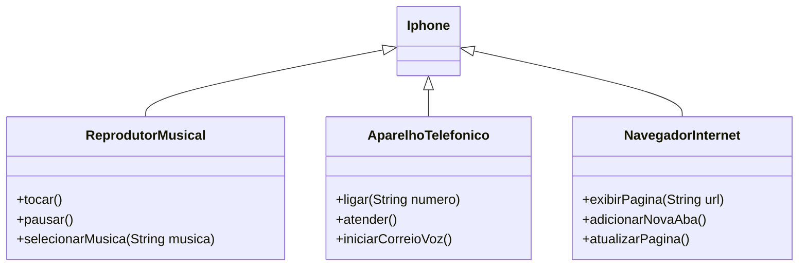

## Autor
[Gustavo Henrique](https://github.com/gustavosantossh)

## Diagrama UML

```mermaid
classDiagram
    Iphone <|-- ReprodutorMusical
    Iphone <|-- AparelhoTelefonico
    Iphone <|-- NavegadorInternet

    class ReprodutorMusical{
      +tocar()
      +pausar()
      +selecionarMusica(String musica)
    }
    class AparelhoTelefonico{
      +ligar(String numero)
      +atender()
      +iniciarCorreioVoz()
    }
    class NavegadorInternet{
      +exibirPagina(String url)
      +adicionarNovaAba()
      +atualizarPagina()
    }
```
